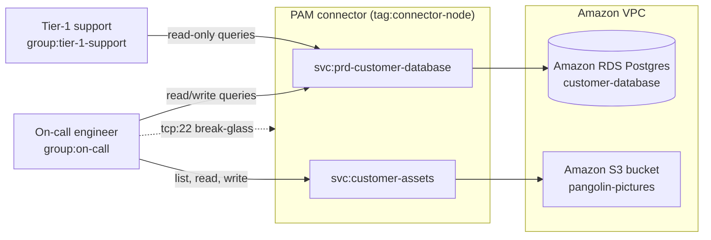

# Amazon RDS and Amazon S3

A support team needs to read customer records in production, and an on-call
engineer needs to change them. Both live in an Amazon Relational Database
Service (Amazon RDS) instance inside a private Amazon Virtual Private Cloud
(Amazon VPC), next to an Amazon Simple Storage Service (Amazon S3) bucket
holding customer uploads. Neither job should involve handing anyone a database
password or a set of AWS keys.

This example puts a PAM connector inside the Amazon VPC. The PAM connector
holds the Postgres credential and the AWS credential; users hold neither. The
tailnet group a person belongs to decides what they can do, so moving someone
between groups changes their access immediately.

## What it models



Nothing in the policy grants `tcp:5432` to the Amazon RDS instance, and nothing
hands out AWS keys. The PAM connector is the only thing holding either
credential, so the only route to the data is through a service. This means
every query and every object operation is permission-checked and recorded.

## Who gets what

| Group | `svc:prd-customer-database` | `svc:customer-assets` | `tag:connector-node` |
|---|---|---|---|
| `group:tier-1-support` | read-only queries, any database | No access | No access |
| `group:on-call` | read/write queries, any database | list, read, write | SSH as `ubuntu` |

Both database grants name `"database": "*"`, so they cover every database on
the instance. List names instead if you only want one of them.

The two rows differ only in `allowed_query_types`. PAM classifies each
statement as it passes through, so `ReadOnly` rejects any statement that
writes. This needs no change on the Amazon RDS side. The service keeps using
the same upstream credential for both groups.

The SSH grant is the one piece of direct access in the policy, and it is there
because the PAM connector cannot broker access to itself.

## Set up the recipe

1. [Enable the PAM integration][pam-get-started], then launch an Amazon Elastic
   Compute Cloud (Amazon EC2) instance in a subnet that can reach the Amazon RDS
   instance. This instance becomes your PAM connector.
1. Install Tailzero, the application that runs a PAM connector, and join it to
   your tailnet. To install Tailzero when you create the Amazon EC2 instance,
   provide the one-line setup command as cloud-init user data.
   [`user-data.yml`](../assets/user-data.yml) has an example.
1. Create a [database service][pam-database] named `prd-customer-database` on
   that PAM connector, pointed at the Amazon RDS endpoint and holding the
   Postgres credential. The names have to match the `svc:` references in the
   policy file.
1. Create an [Amazon S3 service][pam-s3] named `customer-assets`, and give the
   PAM connector an instance role or static credentials that can reach the
   bucket.
1. Apply [`policy.hujson`](./policy.hujson). Refer to the project-wide
   [README](../README.md) for advice on how to do this.

## Test the recipe

If the database is empty, [`assets/sample-data.sql`](../assets/sample-data.sql)
creates `customers` and `orders` tables with a few dozen rows in them.

Put yourself in `group:tier-1-support` by editing the group section of the policy:

```json
	"groups": {
	  // Put your Tailscale user into the tier-1-support group, replacing the
		// example user.
		"group:tier-1-support": ["ameliepangolin@gmail.com"],
		"group:on-call":        [],
	},
```

Reads work, and there is no password to type. The PAM connector holds the
credential, and Tailscale checks your identity:

```shell
psql -h prd-customer-database -p 5432 -d postgres \
    -c 'SELECT id, email, country FROM customers LIMIT 5;'
```

Writes do not:

```shell
psql -h prd-customer-database -p 5432 -d postgres \
    -c "UPDATE orders SET status = 'refunded' WHERE id = 42;"
```

Move yourself to `group:on-call` and the same statement succeeds, and the
bucket appears alongside it. Point the AWS CLI at the service rather than at
AWS:

```ini
[profile customer-assets]
aws_access_key_id     = unused_placeholder
aws_secret_access_key = unused_placeholder
endpoint_url          = http://customer-assets
addressing_style      = path
```

```shell
aws --profile customer-assets s3 ls s3://pangolin-pictures/
```

The credentials there are placeholders. The CLI insists on finding something,
but the PAM connector is what actually talks to AWS.

## Clean up

If you created new AWS resources for this recipe, delete them when you finish
to avoid unnecessary costs.

## Notes

- The Amazon S3 grant doesn't include `delete`, so on-call can repair
  customer data but can't destroy it. Add `delete` to `actions` if on-call
  needs to remove objects.
- Buckets are filtered in two places: on the service, which decides what the
  PAM connector serves at all, and in the grant's `buckets` and `paths`. It
  is worth narrowing both rather than relying on the grant alone.
- `allowed_query_types` is about the shape of the statement, not the rows it
  touches. If tier-1 support should not see a column at all, that still belongs
  in a database role or a view.
- Swapping Amazon RDS for a self-managed Postgres host changes nothing above
  except where the service points. The grants are unchanged.

[pam-get-started]: https://tailscale.com/docs/privileged-access-management/get-started
[pam-database]: https://tailscale.com/docs/privileged-access-management/how-to/access-database
[pam-s3]: https://tailscale.com/docs/privileged-access-management/how-to/access-s3
