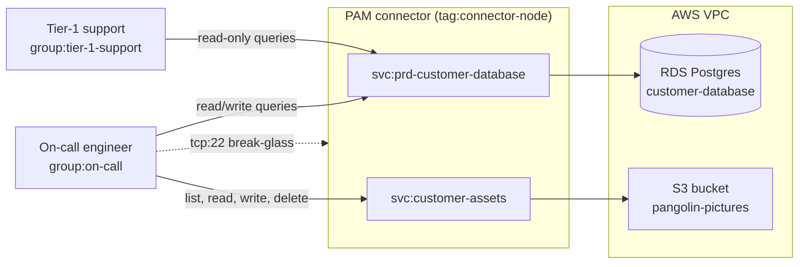

# 01 - AWS RDS and S3

A support team needs to read customer records in production, and an on-call
engineer needs to change them. Both live in an RDS instance inside a private
VPC, next to an S3 bucket holding customer uploads. Neither job should involve
handing anyone a database password or a set of AWS keys.

This example puts a PAM connector inside the VPC. The connector holds the
Postgres credential and the AWS credential; users hold neither. What a person
can do is decided by the tailnet group they are in, so moving someone between
groups changes their access immediately.

## What it models



Nothing in the policy grants `tcp:5432` to the RDS instance, and nothing hands
out AWS keys. The connector is the only thing holding either credential, so
the only route to the data is through a service — which means every query and
every object operation is permission-checked and recorded.

## Who gets what

| | `svc:prd-customer-database` | `svc:customer-assets` | `tag:connector-node` |
|---|---|---|---|
| `group:tier-1-support` | read-only queries, any database | — | — |
| `group:on-call` | read/write queries, any database | list, read, write, delete | SSH as `ubuntu` |

Both database grants name `"database": "*"`, so they cover every database on
the instance. List names instead if you only want one of them.

The two rows differ only in `allowed_query_types`. PAM classifies each
statement as it goes past, so `ReadOnly` refuses anything that writes without
any change on the RDS side — the service keeps using the same upstream
credential for both groups.

The SSH grant is the one piece of direct access in the policy, and it is there
because the connector cannot broker access to itself.

## Setting it up

1. [Enable the PAM integration][pam-get-started], then launch an EC2 instance
   in a subnet that can reach the RDS instance and use it as your connector.
   [`user-data.yml`](./user-data.yml) installs the connector on boot — replace
   `TOKEN_HERE` with the invite token shown when you add a Linux connector.
2. Create a [database service][pam-database] named `prd-customer-database` on
   that connector, pointed at the RDS endpoint and holding the Postgres
   credential. The names have to match the `svc:` references in the policy
   file.
3. Create an [S3 service][pam-s3] named `customer-assets`, and give the
   connector an instance role or static credentials that can reach the bucket.
4. Apply [`policy.hujson`](./policy.hujson), editing the group membership and
   the bucket name to something real.

## Trying it out

If the database is empty, [`assets/sample-data.sql`](../assets/sample-data.sql)
creates `customers` and `orders` tables with a few dozen rows in them.

Put yourself in `group:tier-1-support`. Reads work, and there is no password to
type — the connector holds the credential, and your Tailscale identity is what
was checked:

```console
$ psql -h prd-customer-database -p 5432 -d postgres \
    -c 'SELECT id, email, country FROM customers LIMIT 5;'
```

Writes do not:

```console
$ psql -h prd-customer-database -p 5432 -d postgres \
    -c "UPDATE orders SET status = 'refunded' WHERE id = 42;"
```

Move yourself to `group:on-call` and the same statement succeeds, and the
bucket appears alongside it. Point the AWS CLI at the service rather than at
AWS:

```ini
[profile customer-assets]
aws_access_key_id     = unused_placeholder
aws_secret_access_key = unused_placeholder
endpoint_url          = http://customer-assets
addressing_style      = path
```

```console
$ aws --profile customer-assets s3 ls s3://pangolin-pictures/
```

The credentials there are placeholders. The CLI insists on finding something,
but the connector is what actually talks to AWS.

## Notes

- The S3 grant allows `delete`. Drop it from `actions` if you want on-call to
  be able to repair customer data without being able to destroy it.
- Buckets are filtered in two places: on the service, which decides what the
  connector will serve at all, and in the grant's `buckets` and `paths`. It is
  worth narrowing both rather than relying on the grant alone.
- `allowed_query_types` is about the shape of the statement, not the rows it
  touches. If tier-1 support should not see a column at all, that still belongs
  in a database role or a view.
- Swapping RDS for a self-managed Postgres host changes nothing above except
  where the service points. [02](../02-self-managed-vms) does exactly that.

[pam-get-started]: https://tailscale.com/docs/privileged-access-management/get-started
[pam-database]: https://tailscale.com/docs/privileged-access-management/how-to/access-database
[pam-s3]: https://tailscale.com/docs/privileged-access-management/how-to/access-s3
