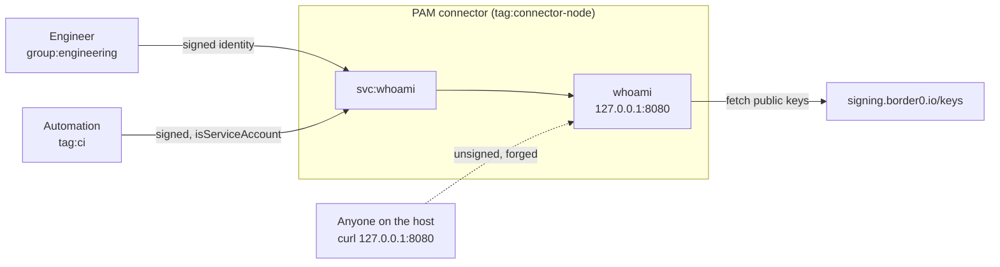

# 02 - Internal web apps and forwarded identity

Networks often have a handful of internal apps that either re-implement auth
each time, or just trust that access to the network is enough protection.

This example puts an internal tool behind a PAM HTTP service. PAM authenticates
the user, then tells the application who they are by adding `X-Auth-*` headers
to the request with a signature.

The sample application here is a small Go application that shows the caller what
information was provided to it by PAM, and whether the signature was verified.

## What it models



The dotted line represents an attacker who has managed to make it onto the
machine hosting our Go service. They could attempt to make a request directly to
the service with forged request headers, to impersonate a real user. Our demo
checks the signature of those headers against the public key published by
Tailscale PAM (previously Border0). This allows the application to then reject
the request.

For more information, see the [header
documentation](https://tailscale.com/docs/privileged-access-management/how-to/access-http-service#pass-tailscale-identity-to-your-web-application).

## Who gets what

| | `svc:whoami` | `tag:connector-node` |
|---|---|---|
| `group:engineering` | HTTP | — |
| `tag:ci` | HTTP, flagged as a service account | — |
| `group:platform` | — | SSH as `ubuntu` |

## Setting it up

1. [Enable the PAM integration][pam-get-started] and create a connector. The
   application runs on the connector host in this example, which keeps the
   recipe to one machine — in practice it would be a separate host the
   connector can reach.
2. Build and run the app on that host:

```console
$ docker build -t whoami ./whoami
$ docker run -d --name whoami -p 127.0.0.1:8080:8080 whoami
```

  Alternatively you can just build and run the Go application directly with `go
  build ./whoami` and run the binary. It listens on `127.0.0.1:8080` by default
  and takes `--listen` and `--jwks-url`.

3. Create an [HTTP service][pam-http] named `whoami` on that connector, with
   `http://127.0.0.1:8080` as the upstream. The name has to match the `svc:`
   reference in the policy file.
4. Edit the [`policy.hujson`](./policy.hujson) to fit your needs, such as adding
   your user into the `group:engineering` group. Then apply the policy to your
   tailnet by copying it into the [Access controls JSON
   editor](https://console.tailscale.com/admin/acls/file).

Plain HTTP upstream is deliberate. PAM terminates TLS for the user; the hop
from the connector to the application stays on the loopback interface, so
there is no certificate to issue and nothing to trust.

## Trying it out

Open the service from the Tailscale client. You get a green panel, your own
email under **Verified identity**, and the exact canonical string the signature
was checked against.

Now lets test out the forgery route by claiming to be someone else. SSH into the
connector which has direct access to our demo application and use this curl
command to forge the request. You may need to alter the destination if you're
running the application on a different port.

```console
$ curl -s -H 'X-Auth-Email: ceo@example.com' http://127.0.0.1:8080/ | jq '.signature.status, .in_signed_header_set'
"unsigned"
[
  {
    "name": "Host",
    "value": "127.0.0.1:8080"
  },
  {
    "name": "X-Auth-Email",
    "value": "ceo@example.com"
  }
]
```

The curl request has provided fake headers claiming to be `ceo@example.com`, but
because it cannot provide a valid signature the application does not trust the
claim.

[pam-get-started]: https://tailscale.com/docs/privileged-access-management/get-started
[pam-http]: https://tailscale.com/docs/privileged-access-management/how-to/access-http-service
