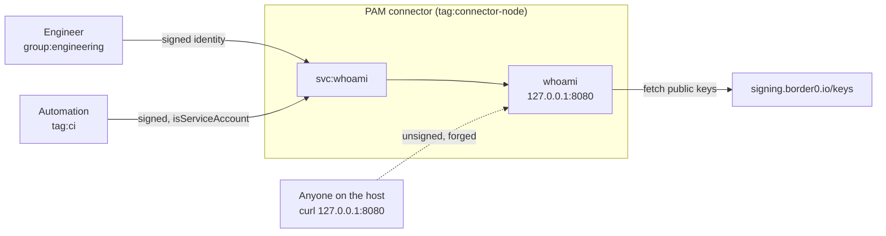

# Internal web apps and forwarded identity

Networks often have a handful of internal apps that either re-implement auth
each time, or trust that access to the network is enough protection.

This example puts an internal tool behind a PAM HTTP service. PAM authenticates
the user, then tells the application who they are by adding `X-Auth-*` headers
to the request with a signature.

The sample application here is a small Go application that shows the caller what
information PAM provided to it, and whether the signature was verified.

## What it models



The dotted line represents an attacker who has gained access to the machine
running the `whoami` app. The attacker could send requests directly to the app
with forged headers to impersonate a real user. The app checks the header
signature against the public key that Tailscale PAM (previously Border0)
publishes as a JSON Web Key Set (JWKS), so it rejects these requests.

For more information, refer to the [header
documentation](https://tailscale.com/docs/privileged-access-management/how-to/access-http-service#pass-tailscale-identity-to-your-web-application).

## Who gets what

| Source | `svc:whoami` | `tag:connector-node` |
|---|---|---|
| `group:engineering` | HTTP | No access |
| `tag:ci` | HTTP, flagged as a service account | No access |
| `group:platform` | No access | SSH as `ubuntu` |

## Set up the recipe

1. [Enable the PAM integration][pam-get-started] and create a PAM connector. In
   this example, the application runs on the PAM connector host, which keeps
   the recipe to one machine. In practice, the application runs on a separate
   host that the PAM connector can reach.
2. Build and run the app on that host:

   ```shell
   docker build -t whoami ./whoami
   docker run -d --name whoami -p 127.0.0.1:8080:8080 whoami
   ```

   Alternatively, you can build and run the Go application directly with
   `go build ./whoami` and run the binary. It listens on `127.0.0.1:8080` by
   default and takes `--listen` and `--jwks-url`.

3. Create an [HTTP service][pam-http] named `whoami` on that PAM connector, with
   `http://127.0.0.1:8080` as the upstream. The name has to match the `svc:`
   reference in the policy file.
4. Edit the [`policy.hujson`](./policy.hujson) to fit your needs, such as adding
   your user into the `group:engineering` group. Then apply the policy to your
   tailnet by copying it into the
   [**Access controls**](https://console.tailscale.com/admin/acls/file) page of
   the admin console.

Plain HTTP upstream is deliberate. PAM terminates TLS for the user; the hop
from the PAM connector to the application stays on the loopback interface, so
there is no certificate to issue and nothing to trust.

## Test the recipe

Open the service from the Tailscale client. You get a green panel, your own
email under **Verified identity**, and the exact canonical string the signature
was checked against.

Next, test the forgery route by claiming to be someone else. Open an SSH session
on the PAM connector, which has direct access to the `whoami` app, and run this
`curl` command to send a forged request. If the application listens on a
different port, change the port in the command.

```shell
curl -s -H 'X-Auth-Email: ceo@example.com' http://127.0.0.1:8080/ | jq '.signature.status, .in_signed_header_set'
"unsigned"
[
  {
    "name": "Host",
    "value": "127.0.0.1:8080"
  },
  {
    "name": "X-Auth-Email",
    "value": "ceo@example.com"
  }
]
```

The curl request has provided fake headers claiming to be `ceo@example.com`, but
because it cannot provide a valid signature the application does not trust the
claim.

[pam-get-started]: https://tailscale.com/docs/privileged-access-management/get-started
[pam-http]: https://tailscale.com/docs/privileged-access-management/how-to/access-http-service
