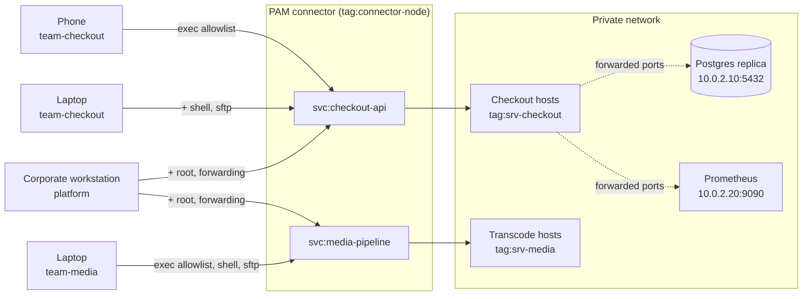

# Fine-grained SSH with device posture

Two product teams each own a fleet of Linux hosts. A platform team owns the
hosts underneath both. Nobody has direct SSH to any of it, and what you are
allowed to do after you connect to a host depends on the device you connected
from.

This example uses [device
posture](https://tailscale.com/docs/features/device-posture) to adapt a user's
access based on the device they're accessing the service from. The same person,
in the same group, could get limited access from their phone, and a root shell
from their corporate laptop.

## What it models



Every session goes through the PAM connector, so every session is
permission-checked and recorded. There are no `tcp:22` grants pointing at
`tag:srv-checkout` or `tag:srv-media`, and no Tailscale SSH rules targeting
them, so there is no way around it.

## Who gets what

Both the user's team and the posture of the device they connect from determine
their permissions.

| Group and device | `svc:checkout-api` | `svc:media-pipeline` |
|---|---|---|
| `team-checkout`, any device | exec allowlist, as `checkout` | No access |
| `team-checkout`, `managedDevice` | + shell, SFTP, unrestricted exec | No access |
| `team-media`, any device | No access | exec allowlist, as `media` |
| `team-media`, `managedDevice` | No access | + shell, SFTP, unrestricted exec |
| `platform`, `privilegedWorkstation` | + `root`, + port forwarding | + `root`, + port forwarding |

Two postures gate the rows:

- **`managedDevice`**: The device is running a desktop OS. This is enough for a
  shell.
- **`privilegedWorkstation`**: The device is running a desktop OS *and* has
  `custom:deviceOwnership == 'corporate'`. This is enough for root and for
  forwarding a production port to your device.

In this example, the postures are minimal so you can adapt them. Consider
additional attributes such as `node:tsVersion >= '1.102.0'`,
`node:tsAutoUpdate == true`, `ip:country IN ['GB', 'IE']`, or an attribute from
an endpoint detection and response (EDR) or mobile device management (MDM)
integration.

## Set up the recipe

1. [Enable the PAM integration and create a PAM connector][pam-get-started] on a
   host that can reach both fleets.
1. Create two SSH PAM services on that PAM connector, named `checkout-api` and
   `media-pipeline`. The names have to match the `svc:` references in the
   policy file.
1. Apply [`policy.hujson`](./policy.hujson), editing the group membership to
   something real.
1. Give yourself the posture attribute the privileged tier needs:

   ```shell
   # Use the helper script to grant a particular posture attribute. The
   # script asks you to provide an API key with the appropriate access.
   # By default the script targets the device you run it on.
   # Run it with `--help` for more info.
   ./set-posture-attribute.sh deviceOwnership corporate
   ```

## Test the recipe

Put yourself in `group:team-checkout` and connect to `svc:checkout-api` from a
phone. This works:

```shell
systemctl status checkout-api
```

An interactive shell does not. Neither does `df -h /`, because the allowlist
has `^df -h$` and the regexes are anchored. An unanchored pattern would also
match `df -h; bash`.

Connect from a laptop and the shell appears, but `root` is still refused.

Move yourself to `group:platform` and you get root on both fleets, plus
forwarding to the replica and to Prometheus. This access lasts only while the
attribute is set. Take the attribute away and watch the access disappear:

```shell
./set-posture-attribute.sh --delete deviceOwnership
```

Attributes can also carry an expiry, so you can demonstrate access expiring
automatically:

```shell
./set-posture-attribute.sh --expiry <expiry-timestamp> deviceOwnership corporate
```

## Notes

- Custom posture attributes are not available on all tiers, and you can only
  set them through the API. There is no admin console equivalent. After you set
  them, you can see them on the **Machine Details** page of the admin console,
  along with which posture assertions the device is currently failing. On a plan
  without custom attributes, swap `custom:deviceOwnership == 'corporate'` for
  `node:tsAutoUpdate == true` to get the same on/off demo.
- In production, you manage custom posture attributes through your MDM as
  part of enrollment and provisioning. The script exists only for trying out
  the demo.
- In production, nobody sets these by hand. Your MDM writes them at enrollment,
  or you bake them in at provisioning time with an OAuth device-provisioning
  key so the user cannot set the attribute on their own machine.

[pam-get-started]: https://tailscale.com/docs/privileged-access-management/get-started
[posture]: https://tailscale.com/kb/1288/device-posture
[recordings]: https://tailscale.com/docs/privileged-access-management/how-to/session-recordings-s3
