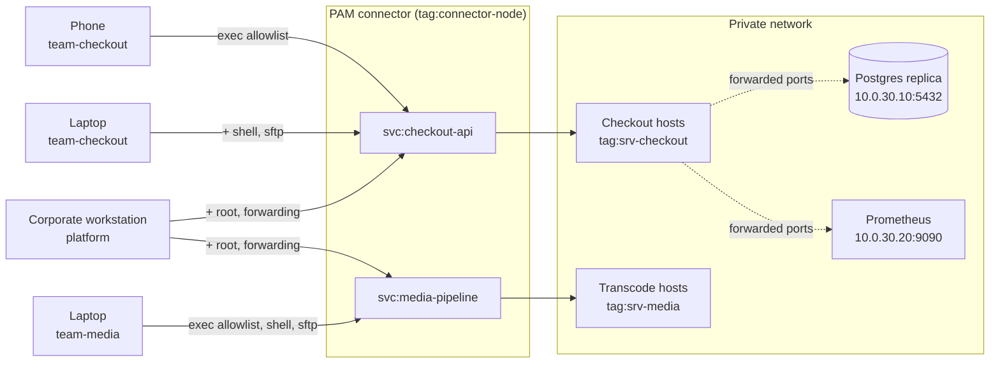

# 03 - Fine-grained SSH with device posture

Two product teams each own a fleet of Linux hosts. A platform team owns the
hosts underneath both. Nobody has direct SSH to any of it, and what you are
allowed to do once you land on a host depends on the device you connected from.

This example leverages [device
postures](https://tailscale.com/docs/features/device-posture) to adapt a user's
access based on the device they're accessing the service from. The same person,
in the same group, could get some very limited access via their phone, and a
root shell from their corporate laptop.

## What it models



Every session goes through the connector, so every session is
permission-checked and recorded. There are no `tcp:22` grants pointing at
`tag:srv-checkout` or `tag:srv-media`, and no Tailscale SSH rules targeting
them, so there is no way around it.

## Who gets what

Permissions are governed by both the users team, and the postures of the device
they're connecting from.

| | `svc:checkout-api` | `svc:media-pipeline` |
|---|---|---|
| `team-checkout`, any device | exec allowlist, as `checkout` | — |
| `team-checkout`, `managedDevice` | + shell, SFTP, unrestricted exec | — |
| `team-media`, any device | — | exec allowlist, as `media` |
| `team-media`, `managedDevice` | — | + shell, SFTP, unrestricted exec |
| `platform`, `privilegedWorkstation` | + `root`, + port forwarding | + `root`, + port forwarding |

Two postures gate the rows:

- **`managedDevice`** — the device is running a desktop OS. Enough for a shell.
- **`privilegedWorkstation`** — a desktop OS *and* `custom:deviceOwnership ==
  'corporate'`. Enough for root and for pulling a production port back to your
  machine.

In this example the postures have been kept simple to make it easy to adapt. You
may want to look at additional attributes like `node:tsVersion >= '1.102.0'`,
`node:tsAutoUpdate == true`, `ip:country IN ['GB', 'IE']`, or an attribute from
an EDR or MDM integration.

## Setting it up

1. [Enable the PAM integration and create a connector][pam-get-started] on a
   host that can reach both fleets.
2. Create two SSH PAM services on that connector, named `checkout-api` and
   `media-pipeline`. The names have to match the `svc:` references in the
   policy file.
3. Apply [`policy.hujson`](./policy.hujson), editing the group membership to
   something real.
4. Give yourself the posture attribute the privileged tier needs:

```console
# Use the helper script to grant a particular posture attribute. The
# script will ask you to provide an API key with the appropriate access.
# By default the script targets the device you run it on.
# Run it with `--help` for more info.
$ ./set-posture-attribute.sh deviceOwnership corporate
```

## Trying it out

Put yourself in `group:team-checkout` and connect to `svc:checkout-api` from a
phone. This works:

```console
$ systemctl status checkout-api
```

An interactive shell does not. Neither does `df -h /`, because the allowlist
has `^df -h$` and the regexes are anchored — an unanchored pattern would also
match `df -h; bash`.

Connect from a laptop and the shell appears, but `root` is still refused.

Move yourself to `group:platform` and you get root on both fleets, plus
forwarding to the replica and to Prometheus — but only while the attribute is
set. Take it away and watch the access disappear:

```console
$ ./set-posture-attribute.sh --delete deviceOwnership
```

Attributes can also carry an expiry, which makes for a tidy demo of access
decaying on its own:

```console
$ ./set-posture-attribute.sh --expiry 2026-10-01T09:00:00Z deviceOwnership corporate
```

## Notes

- Custom posture attributes not available on all tiers, and can only
  be set through the API — there is no admin console equivalent. You can see
  them in the console once set, on the Machine Details page, along with which
  posture assertions the device is currently failing. On a plan without custom
  attributes, swap `custom:deviceOwnership == 'corporate'` for
  `node:tsAutoUpdate == true` to get the same on/off demo.
- In production, you will manage custom posture attributes through your MDM as
  part of enrolment and provisioning. The script provided is just to make the
  demo easier to try out.
- In production, nobody sets these by hand. Your MDM writes them at enrolment,
  or you bake them in at provisioning time with an OAuth device-provisioning
  key so the user cannot set the attribute on their own machine.

[pam-get-started]: https://tailscale.com/docs/privileged-access-management/get-started
[posture]: https://tailscale.com/kb/1288/device-posture
[recordings]: https://tailscale.com/docs/privileged-access-management/how-to/session-recordings-s3
